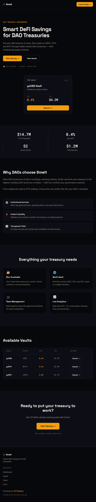
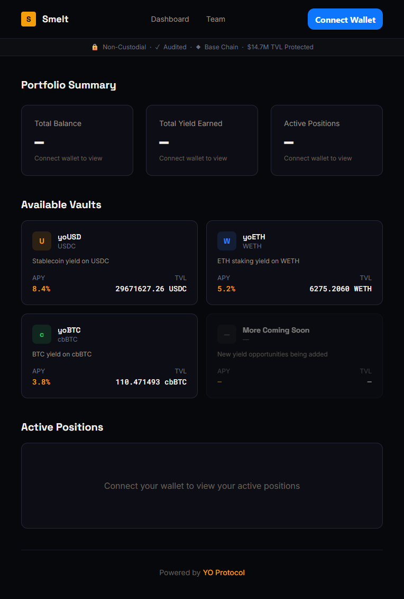
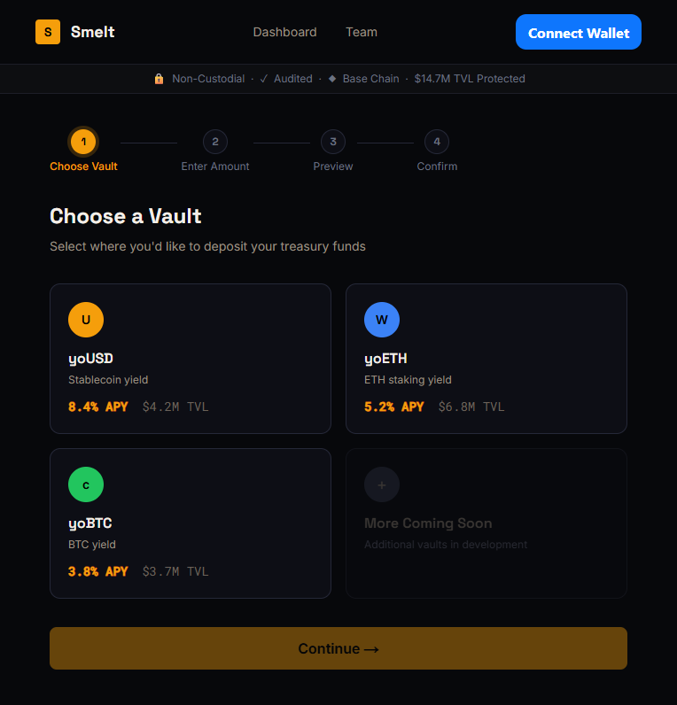
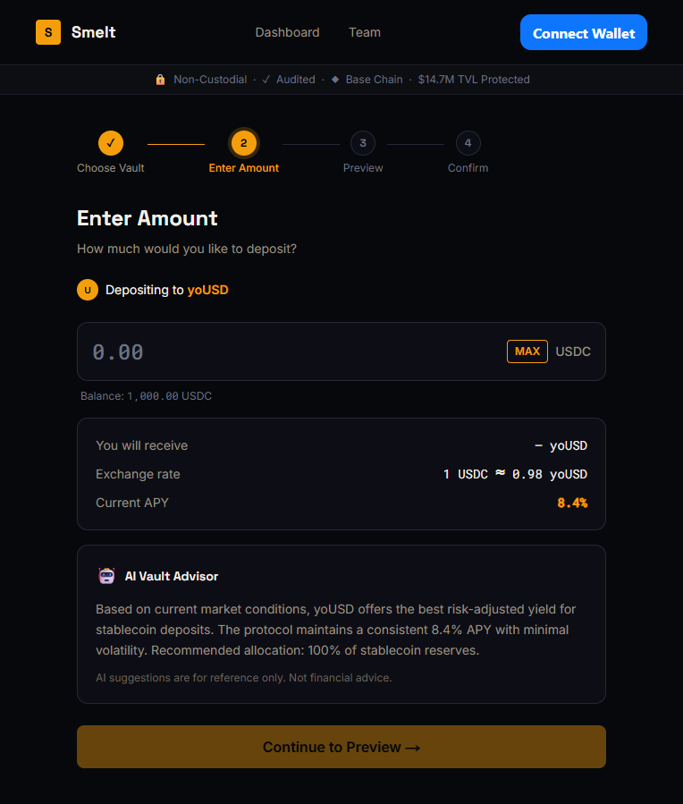
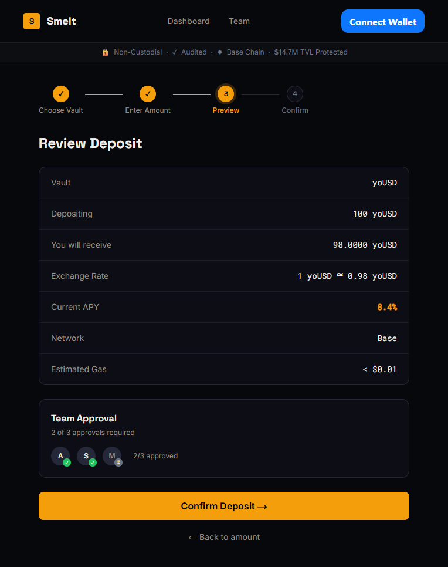
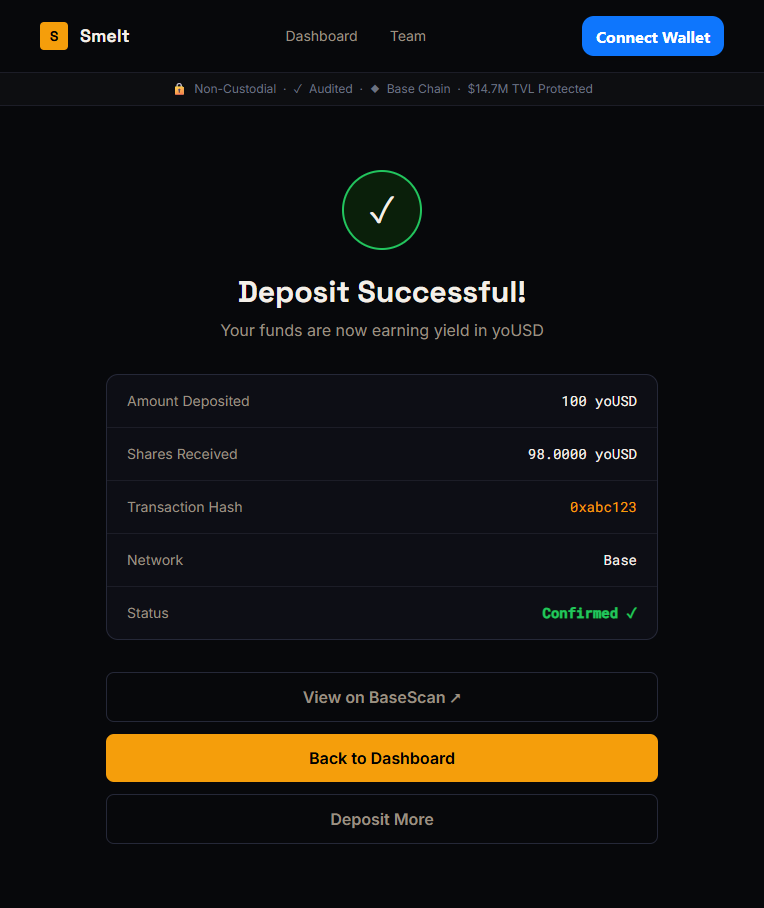
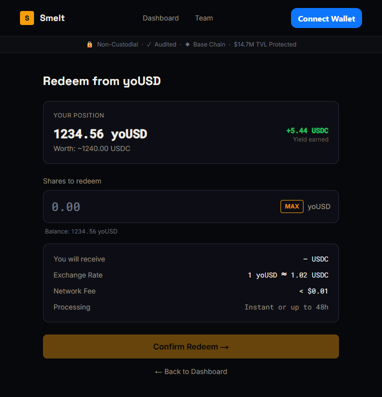
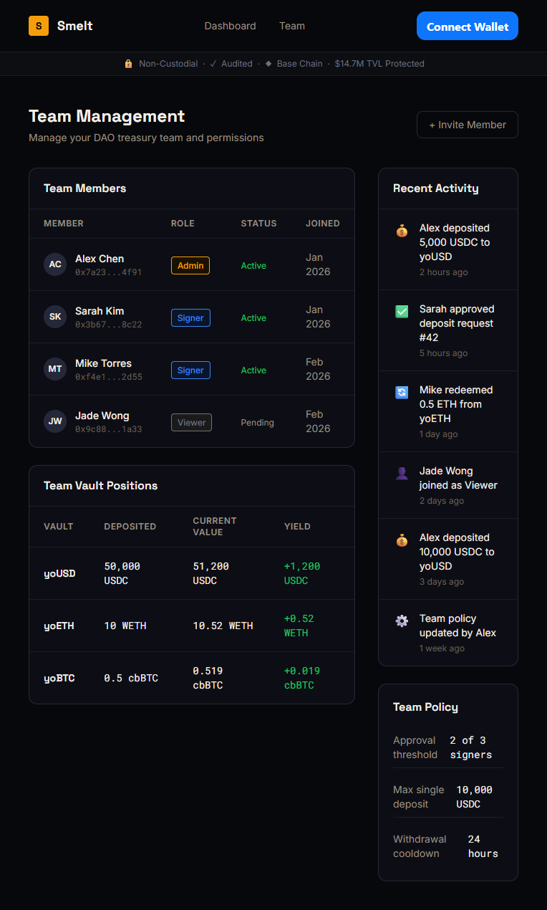

# Aurios | Smart DeFi Savings for DAOs

**Aurios** is an AI-assisted DAO treasury savings product built on [YO Protocol](https://yo.xyz), designed for the *"Hack with YO: Designing Smart DeFi Savings"* hackathon.

Aurios enables DAO treasuries to earn yield on idle assets (USDC, WETH, cbBTC) through YO Protocol vaults on Base L2, with a clean, professional interface that prioritizes transparency, risk disclosure, and simplicity.

---

## Live Demo

> **Demo Video**: [Watch 3-minute walkthrough](#) *(coming soon)*

---

## Screenshots

| Landing | Dashboard |
|---------|-----------|
|  |  |

| Deposit Choose | Deposit Amount |
|----------------|----------------|
|  |  |

| Deposit Preview | Deposit Success |
|-----------------|-----------------|
|  |  |

| Redeem | Team Management |
|--------|-----------------|
|  |  |

---

## User Flow


```
Landing → Connect Wallet → Dashboard
                              ├── Deposit Flow: Choose Vault → Enter Amount → Preview & Risk Disclosure → Confirm → Success
                              ├── Redeem Flow: Select Vault → Enter Shares → Preview → Confirm → Success/Queued
                              └── Team: Manage Members & Roles
```

---

## Architecture


| Layer | Technology | Purpose |
|-------|-----------|---------|
| Frontend | Next.js 14, React 18, Tailwind CSS | App framework, styling |
| Animations | Framer Motion | Page transitions, micro-interactions |
| Wallet | Privy | Wallet connection (MetaMask, WalletConnect, etc.) |
| Onchain | @yo-protocol/core SDK | Deposit, redeem, preview, vault state |
| Chain | Base (L2) | Low-cost transactions |
| Backend | Supabase | Team management, transaction history |
| Data | YO REST API | Live APY, TVL snapshots |

---

## YO SDK Integration

Aurios integrates **15 YO SDK methods** for real onchain interactions, zero mock data:

| Category | SDK Method | Usage |
|----------|-----------|-------|
| **Vault State** | `getVaults` | List available vaults |
| | `isPaused` | Guard deposits when vault is paused |
| **Deposit** | `previewDeposit` | Real-time share estimate before deposit |
| | `depositWithApproval` | Approve + deposit in single flow |
| | `waitForTransaction` | Wait for deposit confirmation |
| **Redeem** | `previewRedeem` | Live preview of assets receivable |
| | `redeem` | Execute redemption with slippage protection |
| | `waitForRedeemReceipt` | Detect instant vs. queued redemptions |
| **User Data** | `getUserPosition` | Shares + assets per vault |
| | `getUserPerformance` | Unrealized P&L |
| | `getUserHistory` | On-chain transaction history |
| | `getPendingRedemptions` | Queued redemption tracking |
| **Analytics** | `getVaultYieldHistory` | 30-day APY chart data |
| | `getVaultTvlHistory` | Historical TVL chart data |
| **REST API** | `GET /api/v1/vault/base/{addr}` | Live APY (1d/7d/30d) + TVL snapshots |

### Vault Addresses (Base Mainnet)

| Vault | Address | Underlying |
|-------|---------|------------|
| yoUSD | `0x0000000f2eb9f69274678c76222b35eec7588a65` | USDC (6 decimals) |
| yoETH | `0x3a43aec53490cb9fa922847385d82fe25d0e9de7` | WETH (18 decimals) |
| yoBTC | `0xbcbc8cb4d1e8ed048a6276a5e94a3e952660bcbc` | cbBTC (8 decimals) |

---

## Key Features

### Smart Vault Advisor
Personalized vault recommendations through 3 quick questions about risk tolerance, time horizon, and asset preference. Guides users to the optimal vault without overwhelming them with DeFi jargon.

### Risk Disclosure & Confirmation
Every deposit requires explicit acknowledgment of smart contract risks, withdrawal timing, and yield variability before transaction submission. No hidden risks.

### Real-Time Data Everywhere
All numbers in the app come from live sources:
- **APY**: YO REST API (refreshed every 5 minutes)
- **TVL**: YO REST API + on-chain aggregation
- **User positions**: YO SDK `getUserPosition` (refreshed every 30 seconds)
- **Share previews**: YO SDK `previewDeposit` / `previewRedeem` (debounced, live)
- **Transaction history**: Merged on-chain (SDK) + off-chain (Supabase) with dedup

### Trust Signals
- Non-custodial badge
- Audited Protocol indicator
- Base Chain verification
- Live TVL from real vault data
- Transaction links to BaseScan

---

## Getting Started

### Prerequisites

- Node.js 18+
- npm or yarn

### Installation

```bash
git clone https://github.com/<your-username>/aurios.git
cd aurios
npm install
```

### Environment Variables

Create `.env.local` in the project root:

```env
NEXT_PUBLIC_WALLETCONNECT_PROJECT_ID=<your-walletconnect-project-id>
NEXT_PUBLIC_SUPABASE_URL=<your-supabase-url>
NEXT_PUBLIC_SUPABASE_ANON_KEY=<your-supabase-anon-key>
NEXT_PUBLIC_PRIVY_APP_ID=<your-privy-app-id>
```

### Run Development Server

```bash
npm run dev
```

Open [http://localhost:3000](http://localhost:3000) in your browser.

### Build for Production

```bash
npm run build
npm start
```

---

## Project Structure

```
aurios/
├── app/                          # Next.js App Router pages
│   ├── page.tsx                  # Landing page
│   ├── dashboard/page.tsx        # Portfolio dashboard
│   ├── deposit/
│   │   ├── choose/page.tsx       # Vault selection
│   │   ├── amount/page.tsx       # Amount input + preview
│   │   ├── preview/page.tsx      # Transaction review + risk modal
│   │   └── success/page.tsx      # Confirmation + BaseScan link
│   ├── redeem/page.tsx           # Redemption flow
│   └── team/page.tsx             # Team management
├── components/                   # Reusable UI components
│   ├── Navbar.tsx                # Navigation + wallet button
│   ├── VaultCard.tsx             # Vault display cards
│   ├── VaultAdvisor.tsx          # Smart Vault Advisor
│   ├── RiskDisclosure.tsx        # Risk confirmation modal
│   ├── YieldChart.tsx            # APY history chart
│   ├── TvlChart.tsx              # TVL history chart
│   ├── TrustBar.tsx              # Trust signals bar (live TVL)
│   ├── AmountInput.tsx           # Token amount input
│   └── ThemeToggle.tsx           # Light/dark mode switch
├── hooks/                        # Custom React hooks
│   ├── useYoClient.ts            # YO SDK client initialization
│   ├── useDeposit.ts             # Deposit flow (approve + deposit + confirm)
│   ├── useRedeem.ts              # Redeem flow (redeem + wait + detect queue)
│   ├── useVaultSnapshot.ts       # Live APY/TVL from YO REST API
│   ├── useUserPosition.ts        # User's vault position
│   ├── useUserPerformance.ts     # Unrealized P&L
│   ├── useUserHistory.ts         # Merged on-chain + off-chain history
│   ├── useVaultYieldHistory.ts   # 30-day APY chart data
│   ├── useVaultTvlHistory.ts     # TVL chart data
│   ├── useVaultPaused.ts         # Vault paused guard
│   └── usePendingRedemptions.ts  # Queued redemption tracking
├── lib/
│   ├── wagmi.ts                  # Wagmi + Privy config
│   ├── chains.ts                 # Base chain config
│   ├── supabase.ts               # Supabase client
│   └── contracts/vaults.ts       # Vault addresses + config
└── public/
    ├── favicon.svg               # Amber hex logo
    └── og-image.svg              # OG preview image
```

---

## Tech Stack

| Category | Technology |
|----------|-----------|
| Framework | [Next.js 14](https://nextjs.org/) (App Router) |
| Language | TypeScript |
| Styling | [Tailwind CSS](https://tailwindcss.com/) |
| Animations | [Framer Motion](https://motion.dev/) |
| Wallet | [Privy](https://privy.io/) |
| Onchain | [@yo-protocol/core](https://www.npmjs.com/package/@yo-protocol/core) |
| Chain | [Base](https://base.org/) (Ethereum L2) |
| Database | [Supabase](https://supabase.com/) |
| Notifications | [Sonner](https://sonner.emilkowal.dev/) |
| Fonts | Space Grotesk, Roboto Mono, Inter |

---

## Hackathon Criteria Alignment

### UX Simplicity (30%)
- 4-step deposit flow with clear progress indicator
- Smart Vault Advisor removes complexity for new users
- Clean typography hierarchy (Space Grotesk titles, Roboto Mono numbers, Inter body)
- Light/dark theme support
- Skeleton loading states on every page
- Toast notifications for all async operations

### Creativity & Growth Potential (30%)
- Smart Vault Advisor: AI-guided vault selection (unique to Aurios)
- DAO team management with multi-member support
- Yield + TVL charts for data-driven decisions
- Merged on-chain + off-chain transaction history

### Quality of Integration (20%)
- 15 YO SDK methods live on Base mainnet
- Real `depositWithApproval` + `redeem` flows with transaction confirmation
- `previewDeposit` / `previewRedeem` for accurate real-time estimates
- Live APY from YO REST API (no hardcoded values)
- Vault pause detection prevents deposits to paused vaults

### Risk & Trust (20%)
- Explicit risk disclosure modal before every deposit
- Trust bar with live TVL, audit status, chain verification
- BaseScan transaction links on success
- Non-custodial architecture: funds never leave user's wallet
- Slippage protection on redemptions (0.5% default)

---

## License

MIT

---

*Built for the "Hack with YO: Designing Smart DeFi Savings" hackathon on [DoraHacks](https://dorahacks.io/).*
